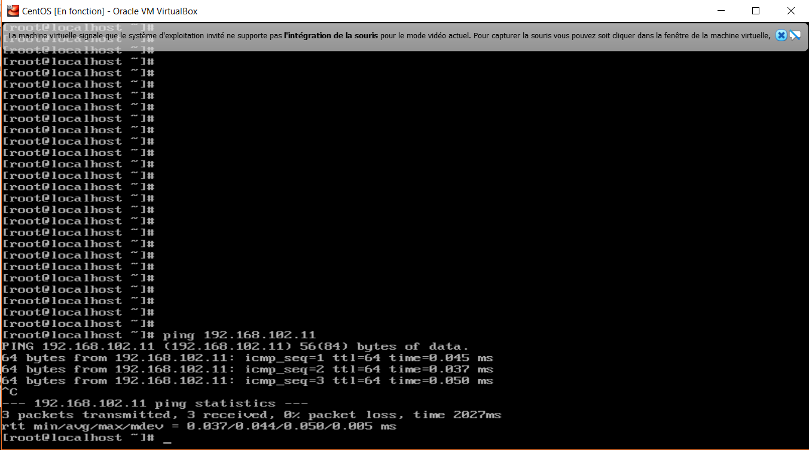

#TP CCNA3
#I-Création
##II-Installation de l'OS
###III-Premier boot
####IV-Config réseau d'une machine CentOS

*A faire*

a. utilisez une commande pour prouver que vous avez internet depuis la VM

b. prouvez que votre PC hôte et la VM peuvent communiquer

Communication du PC d'hôte vers la VM.

Commucation de la VM vers le PC d'hôte.

c. affichez votre table de routage sur la VM et expliquez chacune des lignes

V. Faire joujou avec quelques commandes.

*A faire :*
   1. Ping

      (Depuis le PC d'hôte vers la VM)
      

      (Depuis la VM vers le PC d'hôte)
      

   2. afficher la table de routage
      (Du PC d'hôte)
      

      (De la VM)
      

   3. Mettre en évidence la ligne qui leur permet de discuter.
      (Le PC d'hôte)
      

      (La VM)
      

   4. Curl
      

   5. Dig
      ynov.com
      

      google.com
      

II. Notion de ports et SSH

 *Exploration des ports locaux.*
  1. Utilisez la commande ss pour lister les ports TCP sur lesquels la machine virtuelle écoute.

 a.1 Utilisation de la commande ss:
     

 b.1 Utilisation de la commande ss avec plus d'options:
     La commande ss -4 permet d'avoir uniquement les connexions en IPv4, on peut utiliser.
     

  Utilisation des options.
   b. Utilisation de la commande ss -n pour avoir le numéro du port, plutôt qu'un nom.
      

   c. Utilisation de la commande ss -p pour connaître l'application qui écoute sur ce port.
      

  3. Firewall.
  3.A *A faire*

   a. modifier le fichier /etc/ssh/sshd_config:

   i. changer le numéro du port(strictement supérieur a 1024) sur lequel votre serveur SSH écoute:
      

  ii. vérifiez que votre serveur SSH écoute sur un port différent de 22.
      

 iii. connectez-vous au serveur en utilisant ce port.
      

      Sans autre modification, la connexion devrait échouer.
      Expliquer pourquoi?
      -Parce que l'adresse sur le port 2222 existe déja.
      Trouvez une solution.
      -Il faut lancer le serveur sur un autre port et ensuite essayer de connecter sur le serveur.

B. *A Faire*

   i. Lancer un serveur netcat dans un terminal en utilisant la commande (nc -l)
      

  ii. Le serveur doit écouter sur le port 5454 en TCP et il  faudra autoriser ce port dans le firewall.
      

 iii. Dans un deuxième terminal:
      se connecter au serveur netcat (commande nc).
      

 iv.  Dans un troisième terminal:
      utiliser ss pour visualiser la connexion netcat en cours:
      

III Routage Statique.
1.a Préparation des hôtes (vos PCs):
    Faites en sorte que :

i.   vos deux PCs puissent se ping à travers le câble:
     

ii.  vos carte Ethernet doivent être dans le réseau 12 : 192.168.112.0/30:
     

1.b Préparation VirtualBox

i.  Modifier vos réseaux host-only pour qu'ils soient:
    PC1  réseau 1  192.168.101.0/24:
    

ii. Créez (ou réutilisez) une VM, et modifiez son adresse:

.    VM1 (sur PC1) : 192.168.101.10:
     

1.c Check

   Assurez vous que :

i.   PC1 et PC2 se ping en utilisant le réseau 12:
     

ii.   VM1 et PC1 se ping en utilisant le réseau 1:
      VM1 ping PC1:
      

.     PC2 ping VM2:
      

2. Configuration du routage:

i.  Bilan des adresses IP:

    Ethernet PC1: 192.168.112.11
    Ethernet PC2: 192.168.112.10

    PC1 Host-Only: 192.168.101.11
    PC2 Host-Only: 192.168.102.11

    Carte Host-Only VM1: 192.168.101.10
    Carte Host-Only VM2: 192.168.102.10

    PC1 devrait pouvoir ping 192.168.102.1 (l'adresse de PC2 dans 2)

ii.   PC1 devrait pouvoir ping 192.168.102.1 (l'adresse de PC2 dans 2):
      

iii.  PC2 devrait pouvoir ping 192.168.101.1 (l'adresse de PC1 dans 1):
      

1.  VM1

i.  VM1 devrait pouvoir ping 192.168.112.2, l'adresse de PC2 dans le réseau 12:
    

ii. VM1 devrait pouvoir ping 192.168.102.1, l'adresse de PC2 dans le réseau 2:
    

iii. VM2 devrait pouvoir ping 192.168.112.1, l'adresse de PC1 dans le réseau 12.
     

iv.  VM2 devrait pouvoir ping 192.168.101.1, l'adresse de PC1 dans le réseau 1.
     

5. Nom FQDN

i.  PC1, VM1, PC2, VM2:
    
