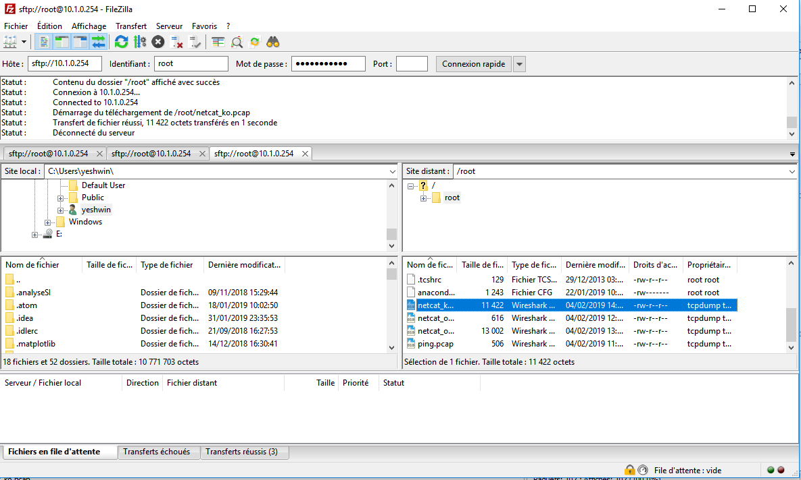

# Mise en place du routage statique.

1. Test

- client1 doit pouvoir ping server1:
  

- server1 doit pouvoir ping client1:
  

- effectuez un traceroute depuis le client pour voir le chemin pris par votre message
  

# Spéléologie réseau.

1.  ARP

a. Manip 1:

i) sur client1:

- afficher la table ARP:
  

- expliquer la seule ligne visible:
  `La commande ip neigh show dev enp0s8 ne montre aucun résultat car apres le sudo ip neigh flush all, il n'y a aucun packets qui passent. Donc c'est normal que la commande ip neigh show dev enp0s8 n'affiche rien.`

ii) sur server1:

- afficher la table ARP:
  

- expliquer la seule ligne visible:
  `La commande ip neigh show dev enp0s8 ne montre aucun résultat car apres le sudo ip neigh flush all, il n'y a aucun packets qui passent. Donc c'est normal que la commande ip neigh show dev enp0s8 n'affiche rien.`

iii) sur client1:

- ping server1:
  

- afficher la table ARP:
  

- expliquer le changement: `le voisin est valide, mais est probablement déjà inaccessible, donc le kernel essaiera de le vérifier lors de la première transmission.`

iv) sur server1:

- afficher la table ARP:
  

- expliquer le changement: `le voisin est valide, mais est probablement déjà inaccessible, donc le noyau essaiera de le vérifier lors de la première transmission.`

b. Manip 2

    vider la table ARP de toutes vos machines

    sur router1:

    afficher la table ARP:

- 

  expliquer les lignes: `La commande ne retourne rien comme resultat car on a vider a table ARP et ensuite afficher la table ARP. Il connait rien donc la table ARP n'affichera rien.`

* `sur client1`

  `ping server1:`

  

* `sur router1`

  `afficher la table ARP`

  

  expliquer le changement: `pas de changement`

c. Manip 3

- `vider la table ARP de toutes vos machines`

- `sur l'hôte (votre PC)`

- afficher la table ARP:


    `PS C:\Users\yeshwin> arp -a

    Interface : 10.1.0.1 --- 0xe
    Adresse Internet      Adresse physique      Type
    10.1.0.10             08-00-27-7c-89-c3     dynamique
    10.1.0.254            08-00-27-e9-91-30     dynamique
    10.1.0.255            ff-ff-ff-ff-ff-ff     statique
    224.0.0.2             01-00-5e-00-00-02     statique
    224.0.0.22            01-00-5e-00-00-16     statique
    224.0.0.251           01-00-5e-00-00-fb     statique
    224.0.0.252           01-00-5e-00-00-fc     statique
    230.0.0.1             01-00-5e-00-00-01     statique
    239.192.152.143       01-00-5e-40-98-8f     statique
    239.255.255.250       01-00-5e-7f-ff-fa     statique

    Interface : 10.188.83.190 --- 0x12
    Adresse Internet      Adresse physique      Type
    10.188.0.1            20-47-47-83-1c-60     dynamique
    10.188.30.172         a0-88-69-86-8b-d9     dynamique
    10.188.92.200         48-6d-bb-be-b1-12     dynamique
    10.188.255.52         a4-17-31-76-eb-03     dynamique
    10.188.255.255        ff-ff-ff-ff-ff-ff     statique
    224.0.0.2             01-00-5e-00-00-02     statique
    224.0.0.22            01-00-5e-00-00-16     statique
    224.0.0.251           01-00-5e-00-00-fb     statique
    224.0.0.252           01-00-5e-00-00-fc     statique
    230.0.0.1             01-00-5e-00-00-01     statique
    239.192.152.143       01-00-5e-40-98-8f     statique
    239.255.255.250       01-00-5e-7f-ff-fa     statique
    255.255.255.255       ff-ff-ff-ff-ff-ff     statique

    Interface : 10.2.0.1 --- 0x17
    Adresse Internet      Adresse physique      Type
    10.2.0.10             08-00-27-0c-22-3c     dynamique
    10.2.0.254            08-00-27-38-f8-3b     dynamique
    10.2.0.255            ff-ff-ff-ff-ff-ff     statique
    224.0.0.2             01-00-5e-00-00-02     statique
    224.0.0.22            01-00-5e-00-00-16     statique
    224.0.0.251           01-00-5e-00-00-fb     statique
    224.0.0.252           01-00-5e-00-00-fc     statique
    230.0.0.1             01-00-5e-00-00-01     statique
    239.192.152.143       01-00-5e-40-98-8f     statique
    239.255.255.250       01-00-5e-7f-ff-fa     statique`

- vider la table ARP:

  `PS C:\Users\yeshwin> arp -d`

- afficher de nouveau la table ARP:


     `PS C:\Users\yeshwin> arp -a

      Interface : 10.1.0.1 --- 0xe
      Adresse Internet      Adresse physique      Type
      10.1.0.255            ff-ff-ff-ff-ff-ff     statique
      224.0.0.22            01-00-5e-00-00-16     statique
      230.0.0.1             01-00-5e-00-00-01     statique
      239.255.255.250       01-00-5e-7f-ff-fa     statique

      Interface : 10.188.83.190 --- 0x12
      Adresse Internet      Adresse physique      Type
      10.188.255.255        ff-ff-ff-ff-ff-ff     statique
      224.0.0.22            01-00-5e-00-00-16     statique
      230.0.0.1             01-00-5e-00-00-01     statique
      239.255.255.250       01-00-5e-7f-ff-fa     statique

      Interface : 10.2.0.1 --- 0x17
      Adresse Internet      Adresse physique      Type
      10.2.0.255            ff-ff-ff-ff-ff-ff     statique
      224.0.0.22            01-00-5e-00-00-16     statique
      230.0.0.1             01-00-5e-00-00-01     statique
      239.255.255.250       01-00-5e-7f-ff-fa     statique`

- `attendre un peu`

- afficher encore la table ARP:


    `PS C:\Users\yeshwin> arp -a

    Interface : 10.1.0.1 --- 0xe
    Adresse Internet      Adresse physique      Type
    10.1.0.255            ff-ff-ff-ff-ff-ff     statique
    224.0.0.2             01-00-5e-00-00-02     statique
    224.0.0.22            01-00-5e-00-00-16     statique
    224.0.0.251           01-00-5e-00-00-fb     statique
    224.0.0.252           01-00-5e-00-00-fc     statique
    230.0.0.1             01-00-5e-00-00-01     statique
    239.192.152.143       01-00-5e-40-98-8f     statique
    239.255.255.250       01-00-5e-7f-ff-fa     statique

    Interface : 10.188.83.190 --- 0x12
    Adresse Internet      Adresse physique      Type
    10.188.0.1            20-47-47-83-1c-60     dynamique
    10.188.11.56          7c-7a-91-8f-7d-e8     dynamique
    10.188.74.16          94-9a-a9-74-33-5b     dynamique
    10.188.92.200         48-6d-bb-be-b1-12     dynamique
    10.188.255.52         a4-17-31-76-eb-03     dynamique
    10.188.255.255        ff-ff-ff-ff-ff-ff     statique
    224.0.0.2             01-00-5e-00-00-02     statique
    224.0.0.22            01-00-5e-00-00-16     statique
    224.0.0.251           01-00-5e-00-00-fb     statique
    224.0.0.252           01-00-5e-00-00-fc     statique
    230.0.0.1             01-00-5e-00-00-01     statique
    239.192.152.143       01-00-5e-40-98-8f     statique
    239.255.255.250       01-00-5e-7f-ff-fa     statique
    255.255.255.255       ff-ff-ff-ff-ff-ff     statique

    Interface : 10.2.0.1 --- 0x17
    Adresse Internet      Adresse physique      Type
    10.2.0.255            ff-ff-ff-ff-ff-ff     statique
    224.0.0.2             01-00-5e-00-00-02     statique
    224.0.0.22            01-00-5e-00-00-16     statique
    224.0.0.251           01-00-5e-00-00-fb     statique
    224.0.0.252           01-00-5e-00-00-fc     statique
    230.0.0.1             01-00-5e-00-00-01     statique
    239.192.152.143       01-00-5e-40-98-8f     statique
    239.255.255.250       01-00-5e-7f-ff-fa     statique`

- expliquer le changement (c'est lié à votre passerelle):``

D. Manip 4

- vider la table ARP de toutes vos machines

- `sur client1:`

- afficher la table ARP:

  `[root@client1 ~]# ip neigh show`

  `10.1.0.1 dev enp0s8 lladdr 0a:00:27:00:00:0e REACHABLE`

- `activer la carte NAT.`

- joindre internet (curl google.com par exemple):

  `[root@client1 ~]# curl google.com`

  `<HTML><HEAD><meta http-equiv="content-type" content="text/html;charset=utf-8">`

  `<TITLE>301 Moved</TITLE></HEAD><BODY>`

  `<H1>301 Moved</H1>`

  `The document has moved`

  `<A HREF="http://www.google.com/">here</A>.`

  `</BODY></HTML>`

- afficher la table ARP:

  `[root@client1 ~]# ip neigh show`

  `10.0.2.2 dev enp0s3 lladdr 52:54:00:12:35:02 STALE`

  `10.1.0.1 dev enp0s8 lladdr 0a:00:27:00:00:0e DELAY`

* expliquer le(s) changement(s): ``

* expliquer quelle machine porte l'IP qui vient de pop dans cette table ARP: ``

l `Machine(tp4)`l `Net1(IP)`l `Net 2 (IP)` l`Adresse physique`

l `client1.tp4` l`10.1.0.10`l `X(Notnet2)`l`08-00-27-7c-89-c3`

l `server1.tp4` l`X(Notnet1)`l `10.2.0.10` l`08-00-27-0c-22-3c`

l `router1.tp4` l`10.1.0.254`l `10.2.0.254` l `10.1.0.254: 08-00-27-e9-91-30` , `10.2.0.254: 08-00-27-38-f8-3b`

2A. Interception d'ARP et ping

- On va ping server1 depuis client1 et observer à la fois les messages ARP et les messages de ping :

```[root@client1 ~]# ip neigh flush all
[root@client1 ~]# ping -c 4 server1.tp4
PING server1.tp4 (10.2.0.10) 56(84) bytes of data.
64 bytes from server1.tp4 (10.2.0.10): icmp_seq=1 ttl=63 time=1.78 ms
64 bytes from server1.tp4 (10.2.0.10): icmp_seq=2 ttl=63 time=2.70 ms
64 bytes from server1.tp4 (10.2.0.10): icmp_seq=3 ttl=63 time=1.73 ms
64 bytes from server1.tp4 (10.2.0.10): icmp_seq=4 ttl=63 time=2.86 ms

--- server1.tp4 ping statistics ---
4 packets transmitted, 4 received, 0% packet loss, time 3007ms
rtt min/avg/max/mdev = 1.736/2.272/2.869/0.519 ms

```

- sur router1


- lancer Wireshark pour enregistrer le trafic qui passer par l'interface choisie et enregistrer le trafic  dans un fichier ping.pcap :

`sudo tcpdump -i enp0s9 -w ping.pcap`
```

[root@router1 ~]# sudo tcpdump -i enp0s9 -w ping.pcap
tcpdump: listening on enp0s9, link-type EN10MB (Ethernet), capture size 262144 bytes

```

- sur router1

- quitter la capture (CTRL + C)
```

^C4 packets captured
5 packets received by filter
0 packets dropped by kernel

```
- vérifier la présence du fichier ping.pcap avec un ls:
```

[root@router1 ~]# ls
anaconda-ks.cfg ping.pcap

```

- envoyer le fichier ping.pcap sur votre hôte


- sur l'hôte (votre PC) :


### Important
- notez que ARP n'est pas encapsulé dans IP, c'est un paquet ARP dans une trame ethernet

- notez que ICMP est encapsulé dans IP, c'est un datagramme ICMP, dans un paquet IP, dans une trame Ethernet !

- NOTEZ BIEN "QUI DISCUTE AVEC QUI" REELLEMENT : au niveau des MAC

- vous devriez en déduire qu'il vous manque la moitié des trames concernant cette communication

- expliquez pourquoi: `On a eu la moitié des trames car on a lancer un ping depuis client1 vers server1 et si on avait lancer un ping depuis server1 vers client1 et de client1 vers server1, on aurait eu les trames en complet.`


B. Interception d'une communication netcat

-  Bon bah je crois que vous le voyez venir :

-  intercepter le trafic.

-  depuis router1:

-  pendant que client1 se connecte au serveur netcat de server1:
```

[root@client1 ~]# nc -vv 10.2.0.10 5454
Ncat: Version 7.50 ( https://nmap.org/ncat )
NCAT DEBUG: Using system default trusted CA certificates and those in /usr/share/ncat/ca-bundle.crt.
NCAT DEBUG: Unable to load trusted CA certificates from /usr/share/ncat/ca-bundle.crt: error:02001002:system library:fopen:No such file or directory
libnsock nsi_new2(): nsi_new (IOD #1)
libnsock nsock_connect_tcp(): TCP connection requested to 10.2.0.10:5454 (IOD #1) EID 8
libnsock nsock_trace_handler_callback(): Callback: CONNECT SUCCESS for EID 8 [10.2.0.10:5454]
Ncat: Connected to 10.2.0.10:5454.
libnsock nsi_new2(): nsi_new (IOD #2)
libnsock nsock_read(): Read request from IOD #1 [10.2.0.10:5454] (timeout: -1ms) EID 18
libnsock nsock_readbytes(): Read request for 0 bytes from IOD #2 [peer unspecified] EID 26

```

-  oubliez pas d'ouvrir le port firewall sur server1:

```

[root@server1 ~]# sudo firewall-cmd --zone=public --add-port=5454/tcp --permanent
success
[root@server1 ~]# sudo firewall-cmd --reload
success

```

-  videz les tables ARP de tout le monde, comme ça on verra encore les messages ARP dans la capture

```

[root@server1 ~]# sudo ip neigh flush all

[root@client1 ~]# sudo ip neigh flush all

```


- échangez quelques messages pour avoir de la matière à étudier :):

```

libnsock nsock_readbytes(): Read request for 0 bytes from IOD #2 [peer unspecified] EID 26
libnsock nsock_trace_handler_callback(): Callback: READ SUCCESS for EID 18 [10.2.0.10:5454] (8 bytes): Bonjour.
Bonjour
libnsock nsock_readbytes(): Read request for 0 bytes from IOD #1 [10.2.0.10:5454] EID 34
libnsock nsock_trace_handler_callback(): Callback: READ SUCCESS for EID 34 [10.2.0.10:5454] (20 bytes): Comment-allez vous?.
Comment-allez vous?
libnsock nsock_readbytes(): Read request for 0 bytes from IOD #1 [10.2.0.10:5454] EID 42
libnsock nsock_trace_handler_callback(): Callback: READ SUCCESS for EID 42 [10.2.0.10:5454] (12 bytes): TP\$.........
libnsock nsock_readbytes(): Read request for 0 bytes from IOD #1 [10.2.0.10:5454] EID 50
libnsock nsock_trace_handler_callback(): Callback: READ SUCCESS for EID 50 [10.2.0.10:5454] (24 bytes): My name is Eden Hazard!.
My name is Eden Hazard!
libnsock nsock_readbytes(): Read request for 0 bytes from IOD #1 [10.2.0.10:5454] EID 58

```


- nommez la capture netcat_ok.pcap:

```

[root@router1 ~]# sudo tcpdump -i enp0s9 -w netcat_ok.pcap
[root@router1 ~]# ls
anaconda-ks.cfg netcat_ok.pcap ping.pcap

```

- Envoyez le fichier netcat_ok.pcap sur votre hôte, puis ouvrez le avec Wireshark. Mettez en évidence :

  

- l'établissement de la connexion TCP:

  

- c'est le "3-way handshake" :

- le client envoie SYN : demande de synchronisation

- le serveur répond SYN,ACK : il accepte la synchronisation

- le client répond ACK : "ok frer, on est bien connectés, on peut échanger de la donnée maintenant !"
  vos messages qui circulent

  `2	0.042546	10.2.0.1	10.2.0.254	TCP	60	2782 → 22 [ACK] Seq=1 Ack=125 Win=254 Len=0`


### HEY j'ai une idée :

- fermer le port firewall du server1:

  `[root@server1 ~]# firewall-cmd --remove-port=5454/tcp`

- refaire la même chose:

  `Creer le server: [root@server1 ~]# nc -l 5454`

- se faire jeter la connexion parce que le port est fermé:

  `[root@client1 ~]# nc -vv 10.2.0.10 5454
   Ncat: Version 7.50 ( https://nmap.org/ncat )
   NCAT DEBUG: Using system default trusted CA certificates and those in /usr/share/ncat/ca-bundle.crt.
   NCAT DEBUG: Unable to load trusted CA certificates from /usr/share/ncat/ca-bundle.crt: error:02001002:system library:fopen:No such file or directory
   libnsock nsi_new2(): nsi_new (IOD #1)
   libnsock nsock_connect_tcp(): TCP connection requested to 10.2.0.10:5454 (IOD #1) EID 8
   libnsock nsock_trace_handler_callback(): Callback: CONNECT ERROR [No route to host (113)] for EID 8 [10.2.0.10:5454]
   Ncat: No route to host.`

- intercepter le trafic dans un fichier netcat_ko.pcap:

```

[root@router1 ~]# sudo tcpdump -i enp0s9 -w netcat_ko.pcap

tcpdump: listening on enp0s9, link-type EN10MB (Ethernet), capture size 262144 bytes

```

- exporter le fichier sur l'hôte:




- mettre en évidence les lignes qui correspondent au firewall qui dit "nop frer"


C. Interception d'un trafic HTTP (BONUS)

-  C'est un bonus mais c'est pas grand chose à faire (genre 5 min?) si vous avez fait le reste. Et c'est délire.
Ca va être la même chose, mais on va intercepter du trafic HTTP. Du trafic web quoi ! De l'HTML qui transite sur le réseau toussa toussa.
Pour que ça se fasse dans de bonnes conditions, je vous propose :
on va installer un serveur web sur server1
tkt frer, ce sera guidé, il y aura très peu de choses à faire, on veut juste un truc simple qui fonctionne.

```

[root@server1 ~]# sudo ifup enp0s3
Connection successfully activated (D-Bus active path: /org/freedesktop/NetworkManager/ActiveConnection/2)
[root@server1 ~]# sudo yum install -y nginx
[root@server1 ~]# sudo firewall-cmd --add-port=80/tcp
success
[root@server1 ~]# sudo firewall-cmd --reload
success
[root@server1 ~]# sudo systemctl start nginx
[root@server1 ~]# sudo ifdown enp0s3
Device 'enp0s3' successfully disconnected.

```

```

[root@server1 ~]# sudo systemctl status nginx
-bash: udo: command not found
[root@server1 ~]# sudo systemctl status nginx
● nginx.service - The nginx HTTP and reverse proxy server
Loaded: loaded (/usr/lib/systemd/system/nginx.service; disabled; vendor preset: disabled)
Active: active (running) since Mon 2019-02-04 15:06:27 CET; 4min 4s ago
Process: 4093 ExecStart=/usr/sbin/nginx (code=exited, status=0/SUCCESS)
Process: 4091 ExecStartPre=/usr/sbin/nginx -t (code=exited, status=0/SUCCESS)
Process: 4090 ExecStartPre=/usr/bin/rm -f /run/nginx.pid (code=exited, status=0/SUCCESS)
Main PID: 4095 (nginx)
CGroup: /system.slice/nginx.service
├─4095 nginx: master process /usr/sbin/nginx
└─4096 nginx: worker process

Feb 04 15:06:27 server1.tp4 systemd[1]: Starting The nginx HTTP and reverse proxy server...
Feb 04 15:06:27 server1.tp4 nginx[4091]: nginx: the configuration file /etc/nginx/nginx.conf syntax is ok
Feb 04 15:06:27 server1.tp4 nginx[4091]: nginx: configuration file /etc/nginx/nginx.conf test is successful
Feb 04 15:06:27 server1.tp4 systemd[1]: Failed to read PID from file /run/nginx.pid: Invalid argument
Feb 04 15:06:27 server1.tp4 systemd[1]: Started The nginx HTTP and reverse proxy server.

[root@server1 ~]# curl localhost:80

<!DOCTYPE html PUBLIC "-//W3C//DTD XHTML 1.1//EN" "http://www.w3.org/TR/xhtml11/DTD/xhtml11.dtd">

<html xmlns="http://www.w3.org/1999/xhtml" xml:lang="en">
    <head>
        <title>Test Page for the Nginx HTTP Server on Fedora</title>
        <meta http-equiv="Content-Type" content="text/html; charset=UTF-8" />
        <style type="text/css">
            /*<![CDATA[*/
            body {
                background-color: #fff;
                color: #000;
                font-size: 0.9em;
                font-family: sans-serif,helvetica;
                margin: 0;
                padding: 0;
            }
            :link {
                color: #c00;
            }
            :visited {
                color: #c00;
            }
            a:hover {
                color: #f50;
            }
            h1 {
                text-align: center;
                margin: 0;
                padding: 0.6em 2em 0.4em;
                background-color: #294172;
                color: #fff;
                font-weight: normal;
                font-size: 1.75em;
                border-bottom: 2px solid #000;
            }
            h1 strong {
                font-weight: bold;
                font-size: 1.5em;
            }
            h2 {
                text-align: center;
                background-color: #3C6EB4;
                font-size: 1.1em;
                font-weight: bold;
                color: #fff;
                margin: 0;
                padding: 0.5em;
                border-bottom: 2px solid #294172;
            }
            hr {
                display: none;
            }
            .content {
                padding: 1em 5em;
            }
            .alert {
                border: 2px solid #000;
            }

            img {
                border: 2px solid #fff;
                padding: 2px;
                margin: 2px;
            }
            a:hover img {
                border: 2px solid #294172;
            }
            .logos {
                margin: 1em;
                text-align: center;
            }
            /*]]>*/
        </style>
    </head>

    <body>
        <h1>Welcome to <strong>nginx</strong> on Fedora!</h1>

        <div class="content">
            <p>This page is used to test the proper operation of the
            <strong>nginx</strong> HTTP server after it has been
            installed. If you can read this page, it means that the
            web server installed at this site is working
            properly.</p>

            <div class="alert">
                <h2>Website Administrator</h2>
                <div class="content">
                    <p>This is the default <tt>index.html</tt> page that
                    is distributed with <strong>nginx</strong> on
                    Fedora.  It is located in
                    <tt>/usr/share/nginx/html</tt>.</p>

                    <p>You should now put your content in a location of
                    your choice and edit the <tt>root</tt> configuration
                    directive in the <strong>nginx</strong>
                    configuration file
                    <tt>/etc/nginx/nginx.conf</tt>.</p>

                </div>
            </div>

            <div class="logos">
                <a href="http://nginx.net/"></a>

                <a href="http://fedoraproject.org/"></a>
            </div>
        </div>
    </body>

</html>

tc

```

```
